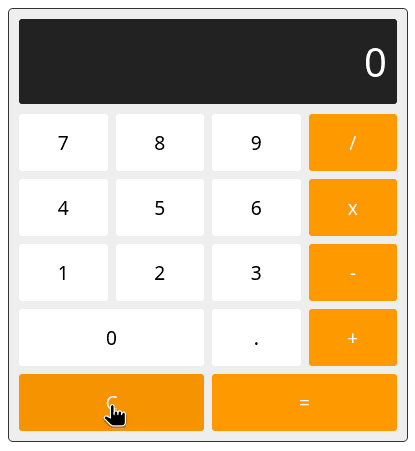

# JavaScript Calculator

A Graphic Calculator in JavaScript

## Learning Objectives

After completing this lab, students will be able to:

1. Respond to user input
2. Attach event listeners to DOM elements
3. Update the DOM following user events

## Task

Handout code is provided in [index.html](index.html). Extend this code to complete the following features:

1. Basic mathematical operations are supported
    * Additon
    * Subtraction
    * Multiplication
    * Division
2. Calculator state is cleared when "C" button in pressed
3. Decimals are properly supported
4. The application is accessible using only the keyboard (tab to change focus, and space to activate buttons)

Your code should live in the `<script>` element at the end of the `<body>` element.

## Resources

- [MDN: Events](https://developer.mozilla.org/en-US/docs/Web/API/Document_Object_Model/Events)
